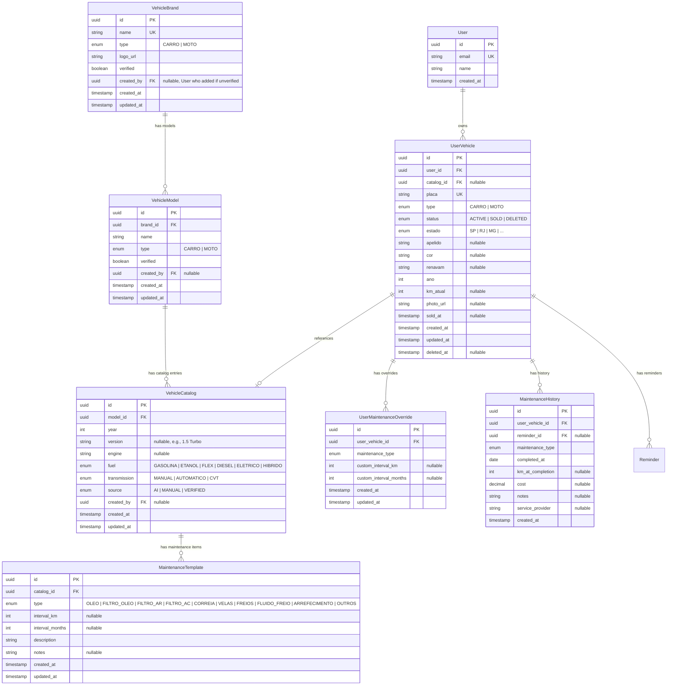

# 03 — Entity Relationship Diagram (ERD)

**Module:** Vehicle  
**Version:** 1.0  
**Last Updated:** December 2024

---

## Overview

This document defines the database schema for the Vehicle module. The design separates shared catalog data (reusable across users) from user-specific vehicle data.

---

## 1. High-Level Architecture

```
┌─────────────────────────────────────────────────────────────────────────────┐
│                           SHARED TABLES                                     │
│                     (System-wide, curated data)                             │
├─────────────────────────────────────────────────────────────────────────────┤
│                                                                             │
│   ┌──────────────┐     ┌──────────────┐     ┌─────────────────┐             │
│   │ VehicleBrand │────▶│ VehicleModel │────▶│ VehicleCatalog  │             │
│   └──────────────┘     └──────────────┘     └─────────────────┘             │
│         │                    │                      │                       │
│         │                    │                      │                       │
│         │                    │                      ▼                       │
│         │                    │              ┌─────────────────┐             │
│         │                    │              │ Maintenance     │             │
│         │                    │              │ Template        │             │
│         │                    │              └─────────────────┘             │
│         │                    │                                              │
└─────────┼────────────────────┼──────────────────────────────────────────────┘
          │                    │
          │                    │
          ▼                    ▼
┌─────────────────────────────────────────────────────────────────────────────┐
│                           USER TABLES                                       │
│                    (Per-user, personal data)                                │
├─────────────────────────────────────────────────────────────────────────────┤
│                                                                             │
│   ┌──────────────┐                                                          │
│   │    User      │ (from Auth module)                                       │
│   └──────────────┘                                                          │
│         │                                                                   │
│         │ owns (1:N)                                                        │
│         ▼                                                                   │
│   ┌──────────────────┐     ┌───────────────────────┐                        │
│   │   UserVehicle    │────▶│ UserMaintenance       │                        │
│   │                  │     │ Override              │                        │
│   └──────────────────┘     └───────────────────────┘                        │
│         │                                                                   │
│         │ has (1:N)                                                         │
│         ▼                                                                   │
│   ┌──────────────────┐     ┌───────────────────────┐                        │
│   │    Reminder      │────▶│ MaintenanceHistory    │                        │
│   │  (from Reminder  │     │                       │                        │
│   │    module)       │     │                       │                        │
│   └──────────────────┘     └───────────────────────┘                        │
│                                                                             │
└─────────────────────────────────────────────────────────────────────────────┘
```

---

## 2. Complete ERD (Mermaid)



---

## 3. Table Definitions

### 3.1 VehicleBrand

**Purpose:** Master list of vehicle brands (Honda, Toyota, Yamaha, etc.)

| Column | Type | Constraints | Description |
|--------|------|-------------|-------------|
| id | UUID | PK, DEFAULT uuid_generate_v4() | Unique identifier |
| name | VARCHAR(100) | NOT NULL, UNIQUE | Brand name (e.g., "Honda") |
| type | ENUM | NOT NULL | Vehicle type (CARRO, MOTO) |
| logo_url | VARCHAR(500) | NULL | URL to brand logo |
| verified | BOOLEAN | NOT NULL, DEFAULT false | Admin-verified brand |
| created_by | UUID | NULL, FK → users.id | User who added (if unverified) |
| created_at | TIMESTAMP | NOT NULL, DEFAULT NOW() | |
| updated_at | TIMESTAMP | NOT NULL, DEFAULT NOW() | |

**Indexes:**
- `idx_vehicle_brand_name` on (name)
- `idx_vehicle_brand_type` on (type)

---

### 3.2 VehicleModel

**Purpose:** Models within each brand (Civic, CG 160, Corolla, etc.)

| Column | Type | Constraints | Description |
|--------|------|-------------|-------------|
| id | UUID | PK | Unique identifier |
| brand_id | UUID | NOT NULL, FK → vehicle_brands.id | Parent brand |
| name | VARCHAR(100) | NOT NULL | Model name (e.g., "Civic") |
| type | ENUM | NOT NULL | Vehicle type (inherited from brand usually) |
| verified | BOOLEAN | NOT NULL, DEFAULT false | Admin-verified model |
| created_by | UUID | NULL, FK → users.id | User who added (if unverified) |
| created_at | TIMESTAMP | NOT NULL, DEFAULT NOW() | |
| updated_at | TIMESTAMP | NOT NULL, DEFAULT NOW() | |

**Indexes:**
- `idx_vehicle_model_brand` on (brand_id)
- `idx_vehicle_model_name` on (name)
- `idx_vehicle_model_brand_name` on (brand_id, name) UNIQUE

---

### 3.3 VehicleCatalog

**Purpose:** Specific vehicle variants with year (Civic 2020 1.5 Turbo)

| Column | Type | Constraints | Description |
|--------|------|-------------|-------------|
| id | UUID | PK | Unique identifier |
| model_id | UUID | NOT NULL, FK → vehicle_models.id | Parent model |
| year | INTEGER | NOT NULL | Model year (1950-2026) |
| version | VARCHAR(100) | NULL | Trim/version (e.g., "1.5 Turbo") |
| engine | VARCHAR(50) | NULL | Engine spec (e.g., "1.5L") |
| fuel | ENUM | NULL | Fuel type |
| transmission | ENUM | NULL | Transmission type |
| source | ENUM | NOT NULL, DEFAULT 'MANUAL' | Data source (AI, MANUAL, VERIFIED) |
| created_by | UUID | NULL, FK → users.id | User/AI that created |
| created_at | TIMESTAMP | NOT NULL, DEFAULT NOW() | |
| updated_at | TIMESTAMP | NOT NULL, DEFAULT NOW() | |

**Indexes:**
- `idx_vehicle_catalog_model` on (model_id)
- `idx_vehicle_catalog_model_year` on (model_id, year) UNIQUE

**Enums:**
```sql
CREATE TYPE fuel_type AS ENUM (
    'GASOLINA', 'ETANOL', 'FLEX', 'DIESEL', 'ELETRICO', 'HIBRIDO'
);

CREATE TYPE transmission_type AS ENUM (
    'MANUAL', 'AUTOMATICO', 'CVT'
);

CREATE TYPE catalog_source AS ENUM (
    'AI', 'MANUAL', 'VERIFIED'
);
```

---

### 3.4 MaintenanceTemplate

**Purpose:** Default maintenance intervals for each catalog entry

| Column | Type | Constraints | Description |
|--------|------|-------------|-------------|
| id | UUID | PK | Unique identifier |
| catalog_id | UUID | NOT NULL, FK → vehicle_catalogs.id | Parent catalog |
| type | ENUM | NOT NULL | Maintenance type |
| interval_km | INTEGER | NULL | KM interval (e.g., 10000) |
| interval_months | INTEGER | NULL | Month interval (e.g., 12) |
| description | VARCHAR(200) | NOT NULL | Display description |
| notes | TEXT | NULL | Additional notes |
| created_at | TIMESTAMP | NOT NULL, DEFAULT NOW() | |
| updated_at | TIMESTAMP | NOT NULL, DEFAULT NOW() | |

**Indexes:**
- `idx_maintenance_template_catalog` on (catalog_id)
- `idx_maintenance_template_catalog_type` on (catalog_id, type) UNIQUE

**Enum:**
```sql
CREATE TYPE maintenance_type AS ENUM (
    'OLEO',
    'FILTRO_OLEO',
    'FILTRO_AR',
    'FILTRO_AC',
    'CORREIA_DENTADA',
    'CORREIA_ALTERNADOR',
    'VELAS',
    'PASTILHA_FREIO',
    'DISCO_FREIO',
    'FLUIDO_FREIO',
    'FLUIDO_ARREFECIMENTO',
    'SUSPENSAO',
    'BATERIA',
    'PNEUS',
    'ALINHAMENTO',
    'BALANCEAMENTO',
    'OUTROS'
);
```

---

### 3.5 UserVehicle

**Purpose:** User's registered vehicles

| Column | Type | Constraints | Description |
|--------|------|-------------|-------------|
| id | UUID | PK | Unique identifier |
| user_id | UUID | NOT NULL, FK → users.id | Owner |
| catalog_id | UUID | NULL, FK → vehicle_catalogs.id | Linked catalog (if any) |
| placa | VARCHAR(7) | NOT NULL, UNIQUE | License plate (normalized) |
| type | ENUM | NOT NULL | CARRO or MOTO |
| status | ENUM | NOT NULL, DEFAULT 'ACTIVE' | Vehicle status |
| estado | CHAR(2) | NOT NULL | Brazilian state (UF) |
| apelido | VARCHAR(50) | NULL | User-defined nickname |
| cor | VARCHAR(30) | NULL | Color |
| renavam | VARCHAR(11) | NULL | Renavam number |
| ano | INTEGER | NOT NULL | Vehicle year |
| km_atual | INTEGER | NULL | Current odometer |
| photo_url | VARCHAR(500) | NULL | S3 URL to vehicle photo |
| sold_at | TIMESTAMP | NULL | When marked as sold |
| created_at | TIMESTAMP | NOT NULL, DEFAULT NOW() | |
| updated_at | TIMESTAMP | NOT NULL, DEFAULT NOW() | |
| deleted_at | TIMESTAMP | NULL | Soft delete timestamp |

**Indexes:**
- `idx_user_vehicle_user` on (user_id)
- `idx_user_vehicle_placa` on (placa) UNIQUE
- `idx_user_vehicle_status` on (status)
- `idx_user_vehicle_deleted` on (deleted_at) WHERE deleted_at IS NOT NULL

**Enum:**
```sql
CREATE TYPE vehicle_status AS ENUM (
    'ACTIVE', 'SOLD', 'DELETED'
);

CREATE TYPE vehicle_type AS ENUM (
    'CARRO', 'MOTO'
);

CREATE TYPE brazilian_state AS ENUM (
    'AC', 'AL', 'AP', 'AM', 'BA', 'CE', 'DF', 'ES', 'GO', 'MA',
    'MT', 'MS', 'MG', 'PA', 'PB', 'PR', 'PE', 'PI', 'RJ', 'RN',
    'RS', 'RO', 'RR', 'SC', 'SP', 'SE', 'TO'
);
```

---

### 3.6 UserMaintenanceOverride

**Purpose:** User customizations to catalog maintenance intervals

| Column | Type | Constraints | Description |
|--------|------|-------------|-------------|
| id | UUID | PK | Unique identifier |
| user_vehicle_id | UUID | NOT NULL, FK → user_vehicles.id | Parent vehicle |
| maintenance_type | ENUM | NOT NULL | Which maintenance item |
| custom_interval_km | INTEGER | NULL | Custom KM interval |
| custom_interval_months | INTEGER | NULL | Custom month interval |
| created_at | TIMESTAMP | NOT NULL, DEFAULT NOW() | |
| updated_at | TIMESTAMP | NOT NULL, DEFAULT NOW() | |

**Indexes:**
- `idx_override_vehicle` on (user_vehicle_id)
- `idx_override_vehicle_type` on (user_vehicle_id, maintenance_type) UNIQUE

---

### 3.7 MaintenanceHistory

**Purpose:** Record of completed maintenance

| Column | Type | Constraints | Description |
|--------|------|-------------|-------------|
| id | UUID | PK | Unique identifier |
| user_vehicle_id | UUID | NOT NULL, FK → user_vehicles.id | Vehicle |
| reminder_id | UUID | NULL, FK → reminders.id | Linked reminder (if any) |
| maintenance_type | ENUM | NOT NULL | Type of maintenance |
| completed_at | DATE | NOT NULL | When completed |
| km_at_completion | INTEGER | NULL | Odometer at completion |
| cost | DECIMAL(10,2) | NULL | Cost in BRL |
| notes | TEXT | NULL | User notes |
| service_provider | VARCHAR(200) | NULL | Where service was done |
| created_at | TIMESTAMP | NOT NULL, DEFAULT NOW() | |

**Indexes:**
- `idx_history_vehicle` on (user_vehicle_id)
- `idx_history_date` on (completed_at)
- `idx_history_type` on (maintenance_type)

---

## 4. Database Migrations Order

```
1. Create enums
2. Create vehicle_brands
3. Create vehicle_models (depends on brands)
4. Create vehicle_catalogs (depends on models)
5. Create maintenance_templates (depends on catalogs)
6. Create user_vehicles (depends on users, catalogs)
7. Create user_maintenance_overrides (depends on user_vehicles)
8. Create maintenance_history (depends on user_vehicles, reminders)
```

---

## 5. Foreign Key Cascade Rules

| Table | FK Column | On Delete | On Update |
|-------|-----------|-----------|-----------|
| vehicle_models | brand_id | RESTRICT | CASCADE |
| vehicle_catalogs | model_id | RESTRICT | CASCADE |
| maintenance_templates | catalog_id | CASCADE | CASCADE |
| user_vehicles | user_id | CASCADE | CASCADE |
| user_vehicles | catalog_id | SET NULL | CASCADE |
| user_maintenance_overrides | user_vehicle_id | CASCADE | CASCADE |
| maintenance_history | user_vehicle_id | CASCADE | CASCADE |
| maintenance_history | reminder_id | SET NULL | CASCADE |

---

## 6. Soft Delete Considerations

Only `user_vehicles` uses soft delete (`deleted_at` column).

**Query Patterns:**
```sql
-- Get active vehicles for user
SELECT * FROM user_vehicles 
WHERE user_id = $1 
  AND deleted_at IS NULL 
  AND status != 'DELETED';

-- Get all vehicles including sold
SELECT * FROM user_vehicles 
WHERE user_id = $1 
  AND deleted_at IS NULL;

-- Hard delete job (90 days)
DELETE FROM user_vehicles 
WHERE deleted_at IS NOT NULL 
  AND deleted_at < NOW() - INTERVAL '90 days';
```

---

## 7. Seed Data

### Initial Brands (v1)

```sql
INSERT INTO vehicle_brands (id, name, type, verified) VALUES
-- Carros
('uuid-1', 'Chevrolet', 'CARRO', true),
('uuid-2', 'Fiat', 'CARRO', true),
('uuid-3', 'Ford', 'CARRO', true),
('uuid-4', 'Honda', 'CARRO', true),
('uuid-5', 'Hyundai', 'CARRO', true),
('uuid-6', 'Jeep', 'CARRO', true),
('uuid-7', 'Nissan', 'CARRO', true),
('uuid-8', 'Renault', 'CARRO', true),
('uuid-9', 'Toyota', 'CARRO', true),
('uuid-10', 'Volkswagen', 'CARRO', true),
-- Motos
('uuid-11', 'Honda', 'MOTO', true),
('uuid-12', 'Yamaha', 'MOTO', true),
('uuid-13', 'Suzuki', 'MOTO', true),
('uuid-14', 'Kawasaki', 'MOTO', true),
('uuid-15', 'BMW', 'MOTO', true);
```

### Popular Models (seed a few, AI generates rest)

```sql
-- Honda Carros
INSERT INTO vehicle_models (id, brand_id, name, type, verified) VALUES
('uuid-m1', 'uuid-4', 'Civic', 'CARRO', true),
('uuid-m2', 'uuid-4', 'City', 'CARRO', true),
('uuid-m3', 'uuid-4', 'HR-V', 'CARRO', true),
('uuid-m4', 'uuid-4', 'Fit', 'CARRO', true);

-- Honda Motos
INSERT INTO vehicle_models (id, brand_id, name, type, verified) VALUES
('uuid-m5', 'uuid-11', 'CG 160', 'MOTO', true),
('uuid-m6', 'uuid-11', 'CB 500', 'MOTO', true),
('uuid-m7', 'uuid-11', 'Biz', 'MOTO', true);
```

---

**Next:** [04-DATA-DICTIONARY.md](./04-DATA-DICTIONARY.md) — Data Dictionary
