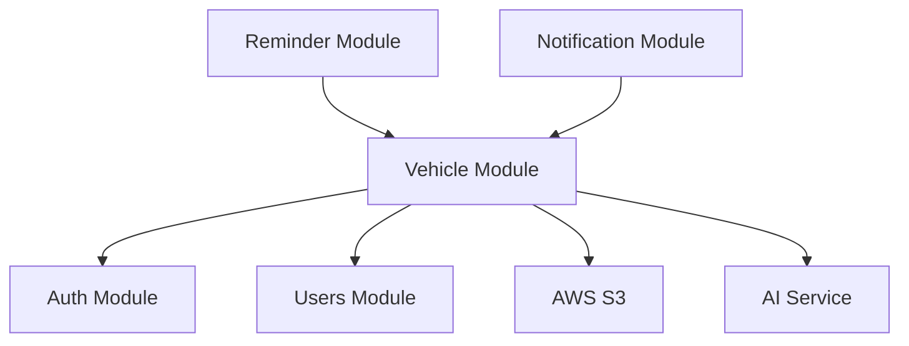

# 07 — Technical Specification

**Module:** Vehicle  
**Version:** 1.0  
**Last Updated:** December 2024

---

## Overview

This document covers the technical implementation details for the Vehicle module, including architecture decisions, integrations, and implementation guidance.

---

## 1. Architecture Overview

### 1.1 Module Structure

```
src/
├── modules/
│   └── vehicle/
│       ├── vehicle.module.ts
│       ├── vehicle.controller.ts
│       ├── vehicle.service.ts
│       ├── vehicle.repository.ts
│       │
│       ├── dto/
│       │   ├── create-vehicle.dto.ts
│       │   ├── update-vehicle.dto.ts
│       │   ├── vehicle-response.dto.ts
│       │   └── ...
│       │
│       ├── entities/
│       │   ├── vehicle-brand.entity.ts
│       │   ├── vehicle-model.entity.ts
│       │   ├── vehicle-catalog.entity.ts
│       │   ├── maintenance-template.entity.ts
│       │   ├── user-vehicle.entity.ts
│       │   ├── user-maintenance-override.entity.ts
│       │   └── maintenance-history.entity.ts
│       │
│       ├── enums/
│       │   ├── vehicle-type.enum.ts
│       │   ├── vehicle-status.enum.ts
│       │   ├── maintenance-type.enum.ts
│       │   └── ...
│       │
│       ├── services/
│       │   ├── brand.service.ts
│       │   ├── model.service.ts
│       │   ├── catalog.service.ts
│       │   ├── catalog-ai.service.ts
│       │   ├── ipva-calculator.service.ts
│       │   └── photo-upload.service.ts
│       │
│       ├── guards/
│       │   └── vehicle-owner.guard.ts
│       │
│       └── utils/
│           ├── placa-validator.ts
│           └── placa-formatter.ts
```

### 1.2 Dependencies



---

## 2. Core Services

### 2.1 VehicleService

**Responsibilities:**
- CRUD operations for user vehicles
- Ownership validation
- Soft delete cascade to reminders
- Vehicle urgency calculation

**Key Methods:**

```typescript
interface VehicleService {
  // CRUD
  create(userId: string, dto: CreateVehicleDto): Promise<UserVehicle>;
  findAllByUser(userId: string, filters: VehicleFilters): Promise<PaginatedResult<UserVehicle>>;
  findById(id: string): Promise<UserVehicle>;
  update(id: string, dto: UpdateVehicleDto): Promise<UserVehicle>;
  softDelete(id: string): Promise<void>;
  
  // Status changes
  markAsSold(id: string): Promise<UserVehicle>;
  reactivate(id: string): Promise<UserVehicle>;
  
  // KM
  updateKm(id: string, km: number): Promise<UserVehicle>;
  
  // Photo
  uploadPhoto(id: string, file: Express.Multer.File): Promise<string>;
  deletePhoto(id: string): Promise<void>;
  
  // Helpers
  validatePlaca(placa: string): Promise<PlacaValidation>;
  calculateDocumentDates(estado: string, placa: string): DocumentDates;
}
```

### 2.2 CatalogService

**Responsibilities:**
- Catalog CRUD
- Catalog matching on vehicle creation
- Maintenance template management

```typescript
interface CatalogService {
  findByModelAndYear(modelId: string, year: number): Promise<VehicleCatalog | null>;
  create(dto: CreateCatalogDto): Promise<VehicleCatalog>;
  getMaintenanceTemplates(catalogId: string): Promise<MaintenanceTemplate[]>;
}
```

### 2.3 CatalogAIService

**Responsibilities:**
- AI-powered catalog generation
- Prompt construction
- Response parsing and validation

```typescript
interface CatalogAIService {
  generate(brand: string, model: string, year: number, type: VehicleType): Promise<GeneratedCatalog>;
}
```

**AI Prompt Template:**

```
Você é um especialista em manutenção automotiva no Brasil.

Para o veículo: {brand} {model} {year} ({type})

Forneça os intervalos de manutenção recomendados em formato JSON:

{
  "maintenance_items": [
    {
      "type": "OLEO",
      "interval_km": <número>,
      "interval_months": <número>,
      "description": "<descrição em português>"
    }
  ]
}

Inclua apenas manutenções comuns: óleo, filtros, correias, velas, freios, fluidos.
Use valores realistas baseados em manuais do fabricante.
```

### 2.4 IpvaCalculatorService

**Responsibilities:**
- IPVA date calculation per state
- Licenciamento date calculation
- Final digit extraction from placa

```typescript
interface IpvaCalculatorService {
  calculate(estado: BrazilianState, placa: string): IpvaLicenciamentoDates;
  getFinalDigit(placa: string): number;
}
```

---

## 3. IPVA/Licenciamento Calendar

### 3.1 São Paulo (SP)

| Final Digit | IPVA Month | Licenciamento Month |
|-------------|------------|---------------------|
| 1 | Janeiro | Fevereiro |
| 2 | Janeiro | Fevereiro |
| 3 | Fevereiro | Março |
| 4 | Fevereiro | Março |
| 5 | Março | Abril |
| 6 | Março | Abril |
| 7 | Abril | Maio |
| 8 | Abril | Maio |
| 9 | Maio | Junho |
| 0 | Maio | Junho |

### 3.2 Rio de Janeiro (RJ)

| Final Digit | IPVA Month | Licenciamento Month |
|-------------|------------|---------------------|
| 1 | Janeiro | Abril |
| 2 | Fevereiro | Maio |
| 3 | Março | Junho |
| 4 | Abril | Julho |
| 5 | Maio | Agosto |
| 6 | Junho | Setembro |
| 7 | Julho | Outubro |
| 8 | Agosto | Novembro |
| 9 | Setembro | Dezembro |
| 0 | Outubro | Janeiro+1 |

### 3.3 Minas Gerais (MG)

| Final Digit | IPVA Month | Licenciamento Month |
|-------------|------------|---------------------|
| 1, 2 | Março | Março |
| 3, 4 | Abril | Abril |
| 5, 6 | Maio | Maio |
| 7, 8 | Junho | Junho |
| 9, 0 | Julho | Julho |

### 3.4 Implementation

```typescript
// ipva-calendar.ts
export const IPVA_CALENDAR: Record<BrazilianState, Record<number, IpvaDates>> = {
  SP: {
    1: { ipva: 1, licenciamento: 2 },
    2: { ipva: 1, licenciamento: 2 },
    3: { ipva: 2, licenciamento: 3 },
    // ...
  },
  RJ: {
    1: { ipva: 1, licenciamento: 4 },
    // ...
  },
  // Other states...
};

// For states not yet mapped, use a default
export const DEFAULT_IPVA_CALENDAR: Record<number, IpvaDates> = {
  1: { ipva: 1, licenciamento: 2 },
  2: { ipva: 2, licenciamento: 3 },
  // ...
};
```

---

## 4. Placa Validation

### 4.1 Validation Function

```typescript
// placa-validator.ts

const OLD_FORMAT = /^[A-Z]{3}[0-9]{4}$/;
const MERCOSUL_FORMAT = /^[A-Z]{3}[0-9][A-Z][0-9]{2}$/;

export function validatePlaca(placa: string): PlacaValidation {
  const normalized = normalizePlaca(placa);
  
  if (OLD_FORMAT.test(normalized)) {
    return { valid: true, format: 'OLD', normalized };
  }
  
  if (MERCOSUL_FORMAT.test(normalized)) {
    return { valid: true, format: 'MERCOSUL', normalized };
  }
  
  return { valid: false, format: null, normalized: null };
}

export function normalizePlaca(placa: string): string {
  return placa
    .toUpperCase()
    .replace(/[^A-Z0-9]/g, '');
}

export function formatPlaca(placa: string): string {
  const normalized = normalizePlaca(placa);
  if (normalized.length === 7) {
    return `${normalized.slice(0, 3)}-${normalized.slice(3)}`;
  }
  return normalized;
}

export function getFinalDigit(placa: string): number {
  const normalized = normalizePlaca(placa);
  // For Mercosul (ABC1D23), get the last NUMBER
  // For old format (ABC1234), get the last digit
  const digits = normalized.match(/\d/g);
  if (!digits || digits.length === 0) {
    throw new Error('Invalid placa: no digits found');
  }
  return parseInt(digits[digits.length - 1], 10);
}
```

### 4.2 Renavam Validation

```typescript
// renavam-validator.ts

export function validateRenavam(renavam: string): boolean {
  // 9-11 digits
  const cleaned = renavam.replace(/\D/g, '');
  return cleaned.length >= 9 && cleaned.length <= 11;
}
```

---

## 5. Photo Upload

### 5.1 S3 Configuration

```typescript
// photo-upload.service.ts

import { S3Client, PutObjectCommand, DeleteObjectCommand } from '@aws-sdk/client-s3';
import sharp from 'sharp';

@Injectable()
export class PhotoUploadService {
  private s3: S3Client;
  private bucket: string;
  
  constructor(private configService: ConfigService) {
    this.s3 = new S3Client({
      region: configService.get('AWS_REGION'),
      credentials: {
        accessKeyId: configService.get('AWS_ACCESS_KEY_ID'),
        secretAccessKey: configService.get('AWS_SECRET_ACCESS_KEY'),
      },
    });
    this.bucket = configService.get('S3_BUCKET');
  }
  
  async upload(vehicleId: string, file: Express.Multer.File): Promise<string> {
    // Validate
    this.validateFile(file);
    
    // Process image
    const processed = await sharp(file.buffer)
      .resize(800, 800, { fit: 'inside', withoutEnlargement: true })
      .jpeg({ quality: 80 })
      .toBuffer();
    
    // Upload
    const key = `vehicles/${vehicleId}/photo.jpg`;
    await this.s3.send(new PutObjectCommand({
      Bucket: this.bucket,
      Key: key,
      Body: processed,
      ContentType: 'image/jpeg',
      ACL: 'private', // Use presigned URLs or CloudFront
    }));
    
    return `https://${this.bucket}.s3.amazonaws.com/${key}`;
  }
  
  async delete(vehicleId: string): Promise<void> {
    const key = `vehicles/${vehicleId}/photo.jpg`;
    await this.s3.send(new DeleteObjectCommand({
      Bucket: this.bucket,
      Key: key,
    }));
  }
  
  private validateFile(file: Express.Multer.File): void {
    const MAX_SIZE = 5 * 1024 * 1024; // 5MB
    const ALLOWED_TYPES = ['image/jpeg', 'image/png'];
    
    if (file.size > MAX_SIZE) {
      throw new BadRequestException('VH-008', 'Foto muito grande (máx 5MB)');
    }
    
    if (!ALLOWED_TYPES.includes(file.mimetype)) {
      throw new BadRequestException('VH-009', 'Formato de foto inválido');
    }
  }
}
```

### 5.2 S3 Bucket Policy

```json
{
  "Version": "2012-10-17",
  "Statement": [
    {
      "Sid": "AllowVehiclePhotos",
      "Effect": "Allow",
      "Action": [
        "s3:PutObject",
        "s3:GetObject",
        "s3:DeleteObject"
      ],
      "Resource": "arn:aws:s3:::autokeeper-photos/vehicles/*"
    }
  ]
}
```

---

## 6. Soft Delete Implementation

### 6.1 Entity Configuration

```typescript
// user-vehicle.entity.ts

@Entity('user_vehicles')
export class UserVehicle {
  // ... other columns
  
  @Column({ type: 'timestamp', nullable: true })
  deleted_at: Date | null;
  
  @BeforeUpdate()
  updateTimestamp() {
    this.updated_at = new Date();
  }
}
```

### 6.2 Repository Methods

```typescript
// vehicle.repository.ts

@Injectable()
export class VehicleRepository {
  constructor(
    @InjectRepository(UserVehicle)
    private repo: Repository<UserVehicle>,
  ) {}
  
  async findAllByUser(userId: string, includeDeleted = false): Promise<UserVehicle[]> {
    const qb = this.repo.createQueryBuilder('v')
      .where('v.user_id = :userId', { userId });
    
    if (!includeDeleted) {
      qb.andWhere('v.deleted_at IS NULL');
    }
    
    return qb.getMany();
  }
  
  async softDelete(id: string): Promise<void> {
    await this.repo.update(id, {
      deleted_at: new Date(),
      status: VehicleStatus.DELETED,
    });
    
    // Cascade to reminders (via Reminder module)
    await this.reminderService.softDeleteByVehicle(id);
  }
}
```

### 6.3 Hard Delete Job

```typescript
// vehicle-cleanup.job.ts

@Injectable()
export class VehicleCleanupJob {
  private readonly logger = new Logger(VehicleCleanupJob.name);
  
  constructor(
    private vehicleRepository: VehicleRepository,
    private photoService: PhotoUploadService,
  ) {}
  
  @Cron('0 3 * * *') // Daily at 3 AM
  async handleCleanup() {
    this.logger.log('Starting vehicle cleanup job');
    
    const retentionDays = 90;
    const cutoffDate = new Date();
    cutoffDate.setDate(cutoffDate.getDate() - retentionDays);
    
    const vehiclesToDelete = await this.vehicleRepository.findDeletedBefore(cutoffDate);
    
    for (const vehicle of vehiclesToDelete) {
      try {
        // Delete photo from S3
        if (vehicle.photo_url) {
          await this.photoService.delete(vehicle.id);
        }
        
        // Hard delete (cascades to related tables)
        await this.vehicleRepository.hardDelete(vehicle.id);
        
        this.logger.log(`Hard deleted vehicle ${vehicle.id}`);
      } catch (error) {
        this.logger.error(`Failed to delete vehicle ${vehicle.id}`, error);
      }
    }
    
    this.logger.log(`Cleanup complete. Deleted ${vehiclesToDelete.length} vehicles.`);
  }
}
```

---

## 7. AI Integration

### 7.1 Service Implementation

```typescript
// catalog-ai.service.ts

@Injectable()
export class CatalogAIService {
  private readonly logger = new Logger(CatalogAIService.name);
  
  constructor(
    private configService: ConfigService,
    private httpService: HttpService,
  ) {}
  
  async generate(
    brand: string,
    model: string,
    year: number,
    type: VehicleType,
  ): Promise<GeneratedCatalog> {
    const prompt = this.buildPrompt(brand, model, year, type);
    
    try {
      const response = await this.callAI(prompt);
      return this.parseResponse(response);
    } catch (error) {
      this.logger.error('AI generation failed', error);
      throw new InternalServerErrorException('VH-013', 'Falha ao gerar dados do veículo');
    }
  }
  
  private buildPrompt(brand: string, model: string, year: number, type: VehicleType): string {
    return `
Você é um especialista em manutenção automotiva no Brasil.

Para o veículo: ${brand} ${model} ${year} (${type === 'CARRO' ? 'Automóvel' : 'Motocicleta'})

Forneça os intervalos de manutenção recomendados. Responda APENAS com JSON válido:

{
  "maintenance_items": [
    {
      "type": "OLEO",
      "interval_km": 10000,
      "interval_months": 12,
      "description": "Troca de óleo do motor"
    }
  ]
}

Tipos válidos: OLEO, FILTRO_OLEO, FILTRO_AR, FILTRO_AC, CORREIA_DENTADA, VELAS, PASTILHA_FREIO, FLUIDO_FREIO, FLUIDO_ARREFECIMENTO

Use valores realistas baseados no mercado brasileiro.
    `.trim();
  }
  
  private async callAI(prompt: string): Promise<string> {
    const apiKey = this.configService.get('ANTHROPIC_API_KEY');
    
    const response = await this.httpService.axiosRef.post(
      'https://api.anthropic.com/v1/messages',
      {
        model: 'claude-sonnet-4-20250514',
        max_tokens: 1000,
        messages: [{ role: 'user', content: prompt }],
      },
      {
        headers: {
          'x-api-key': apiKey,
          'anthropic-version': '2023-06-01',
          'Content-Type': 'application/json',
        },
        timeout: 10000, // 10 second timeout
      },
    );
    
    return response.data.content[0].text;
  }
  
  private parseResponse(response: string): GeneratedCatalog {
    // Extract JSON from response (may have markdown formatting)
    const jsonMatch = response.match(/\{[\s\S]*\}/);
    if (!jsonMatch) {
      throw new Error('No valid JSON found in AI response');
    }
    
    const parsed = JSON.parse(jsonMatch[0]);
    
    // Validate structure
    if (!Array.isArray(parsed.maintenance_items)) {
      throw new Error('Invalid response structure');
    }
    
    return parsed;
  }
}
```

### 7.2 Caching AI Results

AI-generated catalogs are automatically cached by saving to `vehicle_catalogs` table with `source = 'AI'`. Subsequent users with the same brand+model+year will use the cached data.

---

## 8. Performance Considerations

### 8.1 Database Indexes

```sql
-- Placa lookup (global uniqueness check)
CREATE UNIQUE INDEX idx_user_vehicle_placa ON user_vehicles (placa);

-- User's vehicles
CREATE INDEX idx_user_vehicle_user ON user_vehicles (user_id);

-- Filter by status
CREATE INDEX idx_user_vehicle_status ON user_vehicles (status) WHERE deleted_at IS NULL;

-- Soft delete cleanup
CREATE INDEX idx_user_vehicle_deleted ON user_vehicles (deleted_at) WHERE deleted_at IS NOT NULL;

-- Brand search
CREATE INDEX idx_vehicle_brand_name ON vehicle_brands (name);
CREATE INDEX idx_vehicle_brand_type ON vehicle_brands (type);

-- Model lookup
CREATE INDEX idx_vehicle_model_brand ON vehicle_models (brand_id);

-- Catalog lookup
CREATE INDEX idx_vehicle_catalog_model_year ON vehicle_catalogs (model_id, year);
```

### 8.2 Query Optimization

**Vehicle List Query (optimized):**

```sql
SELECT 
  v.*,
  b.name as brand_name,
  m.name as model_name,
  (
    SELECT json_build_object(
      'status', 
      CASE 
        WHEN EXISTS (SELECT 1 FROM reminders r WHERE r.vehicle_id = v.id AND r.due_date < CURRENT_DATE AND r.status = 'ACTIVE') THEN 'OVERDUE'
        WHEN EXISTS (SELECT 1 FROM reminders r WHERE r.vehicle_id = v.id AND r.due_date < CURRENT_DATE + 30 AND r.status = 'ACTIVE') THEN 'WARNING'
        ELSE 'OK'
      END
    )
  ) as urgency
FROM user_vehicles v
JOIN vehicle_models m ON m.id = v.model_id
JOIN vehicle_brands b ON b.id = m.brand_id
WHERE v.user_id = $1
  AND v.deleted_at IS NULL
ORDER BY 
  CASE urgency->>'status'
    WHEN 'OVERDUE' THEN 1
    WHEN 'WARNING' THEN 2
    ELSE 3
  END,
  v.apelido;
```

### 8.3 Caching Strategy

| Data | Cache | TTL | Invalidation |
|------|-------|-----|--------------|
| Brand list | Redis | 24h | On brand create |
| Model list | Redis | 24h | On model create |
| IPVA calendar | Memory | Permanent | Manual (annual) |
| User vehicles | None | — | — |
| Vehicle catalogs | DB (shared) | — | — |

---

## 9. Error Handling

### 9.1 Exception Classes

```typescript
// vehicle.exceptions.ts

export class VehicleException extends HttpException {
  constructor(code: string, message: string, status: HttpStatus = HttpStatus.BAD_REQUEST) {
    super({ code, message }, status);
  }
}

export class InvalidPlacaException extends VehicleException {
  constructor() {
    super('VH-001', 'Placa inválida. Use o formato ABC1234 ou ABC1D23.');
  }
}

export class DuplicatePlacaException extends VehicleException {
  constructor() {
    super('VH-002', 'Esta placa já está cadastrada por outro usuário.', HttpStatus.CONFLICT);
  }
}

export class VehicleNotFoundException extends VehicleException {
  constructor() {
    super('VH-010', 'Veículo não encontrado.', HttpStatus.NOT_FOUND);
  }
}

export class VehicleAccessDeniedException extends VehicleException {
  constructor() {
    super('VH-011', 'Sem permissão para acessar este veículo.', HttpStatus.FORBIDDEN);
  }
}

export class AIGenerationException extends VehicleException {
  constructor() {
    super('VH-013', 'Falha ao gerar dados do veículo.', HttpStatus.INTERNAL_SERVER_ERROR);
  }
}
```

### 9.2 Global Exception Filter

```typescript
// vehicle-exception.filter.ts

@Catch(VehicleException)
export class VehicleExceptionFilter implements ExceptionFilter {
  catch(exception: VehicleException, host: ArgumentsHost) {
    const ctx = host.switchToHttp();
    const response = ctx.getResponse<Response>();
    const status = exception.getStatus();
    const body = exception.getResponse() as { code: string; message: string };
    
    response.status(status).json({
      success: false,
      error: {
        code: body.code,
        message: body.message,
      },
    });
  }
}
```

---

## 10. Testing Strategy

### 10.1 Unit Tests

| Component | Test Cases |
|-----------|------------|
| PlacaValidator | Valid old format, valid Mercosul, invalid formats, normalization |
| IpvaCalculator | Each state, edge cases (December/January), invalid placa |
| VehicleService | CRUD, soft delete, status changes, ownership validation |
| CatalogAIService | Successful generation, timeout, invalid response |

### 10.2 Integration Tests

| Flow | Test Scenario |
|------|---------------|
| Create Vehicle | Happy path with catalog match |
| Create Vehicle | Happy path with AI generation |
| Create Vehicle | Duplicate placa rejection |
| Create Vehicle | Invalid placa rejection |
| Update Vehicle | Estado change with date recalculation |
| Delete Vehicle | Cascade to reminders |
| Photo Upload | Upload, replace, delete |

### 10.3 E2E Tests

| User Flow | Steps |
|-----------|-------|
| Onboarding | Create account → Add first vehicle → Configure reminders |
| Multi-vehicle | Add 3 vehicles → Verify list sorting |
| Sold flow | Add vehicle → Mark as sold → Verify no reminders |
| Delete flow | Add vehicle → Delete → Verify cleanup after 90 days |

---

## 11. Monitoring & Logging

### 11.1 Key Metrics

| Metric | Description | Alert Threshold |
|--------|-------------|-----------------|
| `vehicle.create.count` | Vehicles created per hour | — |
| `vehicle.create.duration` | Creation time (ms) | > 5000ms |
| `vehicle.ai.generate.count` | AI generations triggered | — |
| `vehicle.ai.generate.failure` | AI generation failures | > 5% |
| `vehicle.photo.upload.count` | Photos uploaded | — |
| `vehicle.photo.upload.size` | Average photo size | > 2MB |

### 11.2 Logging Events

```typescript
// Key events to log
this.logger.log('Vehicle created', { vehicleId, userId, placa: masked });
this.logger.log('Vehicle soft deleted', { vehicleId, userId });
this.logger.log('AI catalog generated', { brand, model, year, duration });
this.logger.warn('AI generation failed', { brand, model, year, error });
this.logger.log('Photo uploaded', { vehicleId, size });
```

---

## 12. Security Considerations

### 12.1 Data Protection

| Field | Classification | Protection |
|-------|---------------|------------|
| placa | PII | Mask in logs (`ABC****`) |
| renavam | PII | Mask in logs, encrypt at rest |
| photo_url | User content | Private S3, presigned URLs |
| km_atual | User data | No special handling |

### 12.2 Authorization

```typescript
// vehicle-owner.guard.ts

@Injectable()
export class VehicleOwnerGuard implements CanActivate {
  constructor(private vehicleService: VehicleService) {}
  
  async canActivate(context: ExecutionContext): Promise<boolean> {
    const request = context.switchToHttp().getRequest();
    const userId = request.user.id;
    const vehicleId = request.params.id;
    
    const vehicle = await this.vehicleService.findById(vehicleId);
    
    if (!vehicle) {
      throw new VehicleNotFoundException();
    }
    
    if (vehicle.user_id !== userId) {
      throw new VehicleAccessDeniedException();
    }
    
    // Attach vehicle to request for controller use
    request.vehicle = vehicle;
    return true;
  }
}
```

---

## 13. Deployment Checklist

### 13.1 Pre-Deployment

- [ ] Run database migrations
- [ ] Seed brand/model data
- [ ] Configure S3 bucket and IAM role
- [ ] Set AI API key in environment
- [ ] Configure IPVA calendar for all states
- [ ] Set up cleanup cron job

### 13.2 Environment Variables

```env
# Database
DATABASE_URL=postgresql://...

# AWS S3
AWS_REGION=sa-east-1
AWS_ACCESS_KEY_ID=...
AWS_SECRET_ACCESS_KEY=...
S3_BUCKET=autokeeper-photos

# AI
ANTHROPIC_API_KEY=...

# Feature flags
FEATURE_AI_CATALOG=true
FEATURE_PHOTO_UPLOAD=true
```

### 13.3 Post-Deployment Verification

- [ ] Create test vehicle (happy path)
- [ ] Verify placa uniqueness check
- [ ] Verify photo upload to S3
- [ ] Verify AI generation (if enabled)
- [ ] Verify IPVA date calculation for SP, RJ, MG

---

**End of Technical Specification**

---

## Related Documents

- [00-INDEX.md](./00-INDEX.md) — Document Index
- [01-PRD.md](./01-PRD.md) — Product Requirements
- [02-BUSINESS-RULES.md](./02-BUSINESS-RULES.md) — Business Rules
- [03-ERD.md](./03-ERD.md) — Database Schema
- [04-DATA-DICTIONARY.md](./04-DATA-DICTIONARY.md) — Field Definitions
- [05-API-SPEC.md](./05-API-SPEC.md) — API Endpoints
- [06-USER-FLOWS.md](./06-USER-FLOWS.md) — User Journeys
